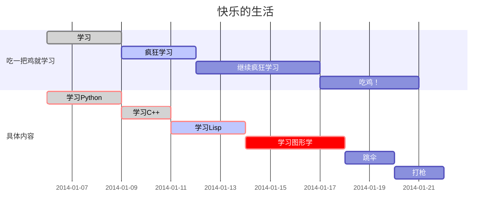

# Typora的语法


## 引用

> 大于> + 空格就是引用


## 字体

*两边一个星号*

**两边两个星号**

***两边三个星号***

~~两边两个波浪号~~

两个==高亮

==fadsfads==

```shell	
==fasdfa==
```


## 图片引用


```bash

```


## 文章格式/段落


---

三个杠杆是分割线


- -无序列表
  1. 表示有序列表


```english
​```+ shell 表示code+语言
```


脚注标记[^ 1 ]


```bash
[^ 1 ]		文中标记
[^ 1 ]: 	后面具体
```


## 列表


| 姓名 | 学校 | 学号 |
| :--: | ---- | ---- |
|      |      |      |
|      |      |      |


```shell
| 姓名| 学校 | 学号 |

```


## 流程图

*和程序一样，语言输入sequence*


```sequence
李雷 -> 韩梅梅: Hello 梅梅, How are you? 
Note right of 韩梅梅: 韩梅梅心想 
韩梅梅 --> 李雷: I'm fine, thanks, and you?
```


*下面语言输入flow*

```flow
st=>start: 闹钟响起
op=>operation: 与床板分离
cond=>condition: 分离成功?
e=>end: 快乐的一天

st->op->cond
cond(yes)->e
cond(no)->op
```


*下面输入 mermaid 渲染 gantt图* 





## 数学语法


$1/2+7/2$


[^ 3 ]:fas


[[zhangjiahui]]


$$ 	\begin{matrix} 1 & x & x^2\\ 1 & y & y^2\\ 1 & z & z^2\\ \end{matrix} $$


## 超链接 


加上协议，变色变成超链接， 按住ctrl 点击就可跳转


http://baidu.com

[点击跳转百度](baidu.com) 表示超链接


```bash
[显示文字](URL)
```


## Html 语法标记 


改变字体颜色大小/改变图片大小位置


```shell
<font>张 </font>
<font size=3 color="red">字体颜色为红色，大小为3</font>
```


<font>张 </font>

<font size=3 color="red">字体颜色为红色，大小为3</font>


## 表情


```shell
:horse:
:emoji:

```


:horse:


## 生成目录


```shell
[toc]
```


[toc]

## 代码处理


```c
#include<studio>


int m,a,z 
void main{
  printf('Hello World')
}

```


## CSS的支持设置和用法


可以用来对特定例如wechat Facebook的特殊排版进行Css设置，达到更好的展示效果，保证排版规范

[Typora Official Website for Themes](https://theme.typora.io)


> 除此以外，如果你有一定的 Web 编程基础，你当然也可以自己修改、新建适合你使用需求的 CSS 文件。我自己就写了一份名为 WeChat 的 CSS 文件，来符合我公众号特定的排版需求，例如正文是 15px，页边距是 8，小标题是 18px 等等。[^ 2 ]


## 其他设置待深入


> ### YAML front-matter
>
> Typora 支持在文档头部加上基于 YAML 的 front-matter 信息，这一特性适用于把 Markdown 文档分类归档上传到用 Hexo 框架搭建的博客中。我对于这一点不太了解，这里就不误导大家了。有所了解的朋友可以在评论区谈谈！[^ 2 ]
>
> 


## 引用

[^ 1 ]: 这是第一个脚注的后面标记
[^ 2 ]: https://sspai.com/post/54912/


4
